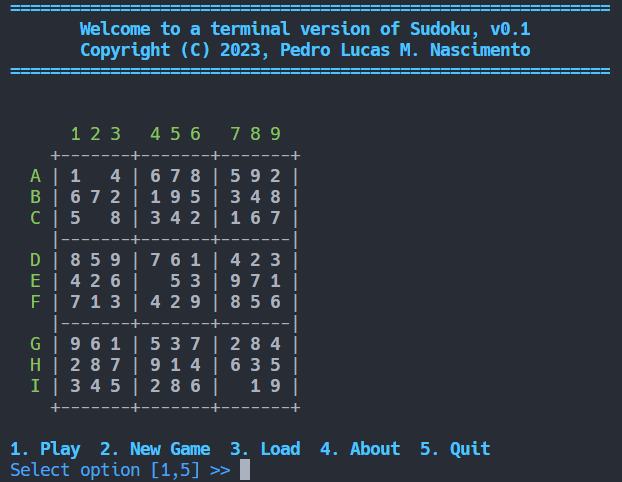
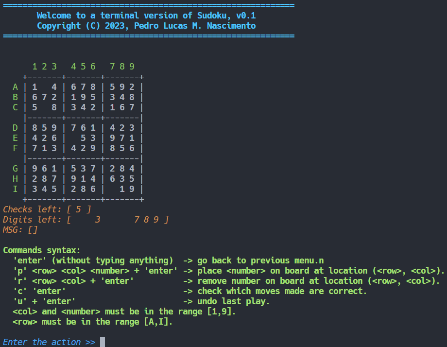

# Sudoku Game :pencil:

Welcome to the Sudoku game project! :video_game:

[](https://github.com/PedroLucas63/sudoku/releases)

## Table of Contents
- [Description](#description) :page_facing_up:
- [Features](#features) :sparkles:
- [Usage Manual](#usage-manual) :book:
- [Compilation Manual](#compilation-manual) :hammer_and_wrench:
- [License](#license) :scroll:
- [Contributions](#contributions) :handshake:
- [Contact](#contact) :email:

## Description :page_facing_up:
Sudoku is a classic number puzzle game. This C++ Sudoku game allows you to play Sudoku in the command line. You can choose from various game options and even load puzzles from files. Challenge yourself and test your Sudoku-solving skills!

## Features :sparkles:
- Play Sudoku with multiple game options.
- Load Sudoku puzzles from files.
- Check your progress with the provided checks.
- Undo moves if you make a mistake.
- User-friendly interface for a seamless gaming experience.



## Usage Manual :book:
1. To start the game, run the following command:
   ```shell
   sudoku [options]
   ```

   Available options:
   - `-c` or `--checks`: Set the number of checks allowed (default is 3).
   - `-h` or `--help`: Display the game's help information.
   - `<file>`: Load a Sudoku puzzle from a file.

2. If no file is provided, the game will list available puzzles in the `./data` folder. Select a puzzle to open.

3. After opening a puzzle, a menu with various options will be displayed:
   - Play: Start the game.
   - New Game: Move to the next available puzzle in the bank.
   - Load/Save: Load the game if no moves were made, or save the game if any moves were made.
   - About: View game information.
   - Quit: Exit the game.

4. When starting a new game, you'll have options like Place, Remove, Check, Undo, and Return:
   - Place: Add a value to a specific cell.
   - Remove: Delete a value from a cell.
   - Check: Verify the correctness of your entries.
   - Undo: Revert your last move.
   - Return: Go back to the main menu without losing your progress.



## Compilation Manual :hammer_and_wrench:
To compile the project, follow these steps:

1. Create a build directory:
   ```shell
   cmake -S . -B build
   ```

2. Build the project:
   ```shell
   cmake --build build
   ```

## License :scroll:
This project is licensed under the MIT License. See the [LICENSE](LICENSE) file for details.

## Contributions :handshake:
Contributions are welcome! If you'd like to contribute to the project, please open an issue or a pull request.

## Contact :email:
If you have any questions or need assistance, feel free to reach out to us at [pedrolucas.jsrn@gmail.com].
